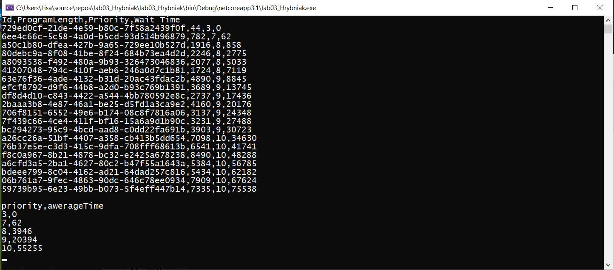
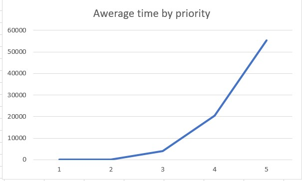
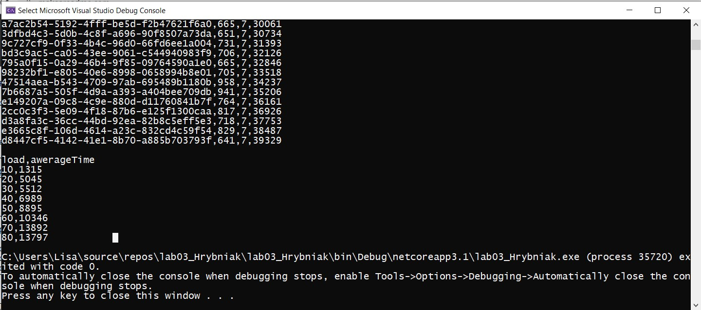

Лабораторна робота №3
===================
Виконала студентка групи ІП-81
Грибняк Єлизавета

----------
Алгоритм Корбато
-------------

Данний алгоритм є різновидом алгоритму FB (Foreground - Background), в основі алгоритму стоїть приорітезація процесів згідно їх довжини. Важається, що довжина програми в байтах прямо пропорційна часу її виконання. Згідно з цього тверждення обраховуємо пріорітети за формулою:
$$
p = |log2 (Ln/Lq) + 1|,
$$
де Ln - довжина програми в байтах; Lq - число байт, які можуть бути передані між ОЗУ і зовнішньою пам'яттю за час tk. 

----------
Виконання
-------------------

Результат виконання програми при тестуванні середнього часу залежно від пріорітету:

Графік залежності середнього часу очікування від пріорітету:

Результат виконання програми при тестуванні середнього часу залежно від інтенсивності:

Графік залежності середьного часу очікування від інтенсивності:
